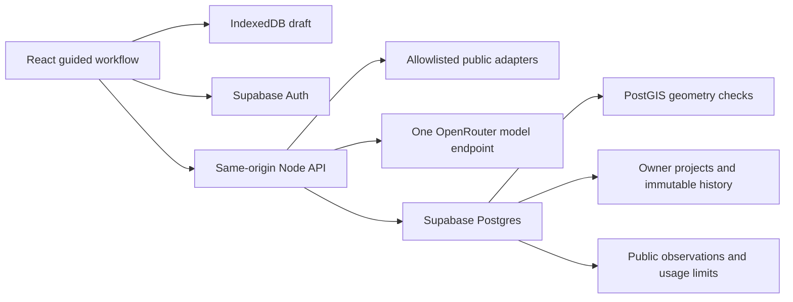

# Housing Navigator v1 technical design

September 26, 2026. Status: RECOMMENDED DESIGN FOR REVIEW. Product requirements are accepted; architecture, limits and implementation sequence below are recommendations, not new approvals. Owners: Het and Rushi. No application implementation, provisioning or publication occurred in this handoff.

Read with the [accepted specification](product-spec-v1-2026-09-26.md), [decision log](product-decisions-2026-09-26.md), [source/check inventory](source-adapter-verification-2026-09-26.md) and [implementation plan](implementation-plan-v1-2026-09-26.md).

## 1. Readiness and decisions

| Category | Current position |
|---|---|
| Accepted | Assessment and next tasks first; comparison secondary; five personas; all work types retained; countywide identity/assessment with bounded municipal coverage; eight pillars, no score; useful 2D; personal projects; outcome-based continuation; explicit AI failure and refresh; React/TypeScript/Vite, Supabase Postgres/Auth, planned Vercel |
| Verified implementation | App branch feat/first-prototype at 6288d5a. `src/domain.ts` embeds Lanark evidence and conditional comparisons; `src/App.tsx` holds session-only proposals and draws real parcel geometry. `src/assessment.ts` permits only Lanark. Markdown export, print and design-system preview exist. Fresh checks: 41 unit tests, typecheck, lint and build each succeeded. Browser claims in prior handoff were not re-run this phase. |
| Not implemented | Generic property resolver, guided integrated intake, runtime AI, durable drafts, Supabase auth/storage, persistent task outcomes/dependencies and general municipal checks |
| Recommended choices here | Thin same-origin Node API, versioned relational records, PostGIS polygon validation, versioned check registry, IndexedDB drafts, one schema-capable model with bounded server requests. No graph database, workflow framework or general agent tools. |
| External prerequisites | Geometry reuse permission, complete municipal crosswalk and boundary tests, reviewed Pittsburgh rule dependencies, actual OpenRouter model/endpoint probe, existing-balance verification through approved integration, Supabase/Vercel configuration, usable SMTP sender/service and backup/log retention configuration |
| Genuine source tension | Nonconformity code certificate language versus City guidance that single-family dwellings/townhouses do not require occupancy certificates. Resolve per building through City review; no universal automated certificate gate. |
| Historical conflicts resolved | Older app notes favor comparison-first and mention a prior deployment request; current accepted record makes assessment/actions primary and this prompt authorizes no deployment. Older stack/persona/scoring questions are historical. Preserve those documents. |

This design can be reviewed without resolving every release prerequisite. The two-person weekend can plausibly demonstrate the focused AI-assisted evidence-to-task loop on bounded fixtures. It cannot credibly promise the full countywide launch minimum, account durability, secure public access and reviewed rule coverage without passing the separate gates. Reducing the demo does not silently reduce the accepted launch minimum.

## 2. Architecture and alternatives

Recommend extending the existing application in place with a thin API and ordinary persisted workflows. Keep the current prototype at `/` and the preview at `/design-system`; integrate the new guided workflow at `/projects/new`. Saved-project routes can use `/projects/:id` once persistence exists. Do not recreate its styles, export semantics or comparison behavior.



| Approach | Tradeoff and recommendation |
|---|---|
| Browser-only connectors plus client storage | Preserves existing demo simplicity, but cannot safely hold model credentials or enforce shared budgets and authoritative transitions. Retain only as dated prototype. |
| Same-origin API plus Supabase | Recommended. Small deployable surface, centralized schemas and allowlisted connectors; SQL transactions own task/dependency changes. Requires auth, migrations and deployment checks. |
| LangGraph or a graph database | Adds deployment, checkpoint and schema work without a demonstrated need. Domain dependencies fit relational edges. Revisit if durable multi-step background execution cannot be expressed with a request record and bounded retry. |

Use fetch-based provider adapters. Add a runtime schema validator with JSON Schema generation, Supabase client and a small IndexedDB wrapper only when their slice needs them. Enable PostGIS in a dedicated schema for complete polygon validation, coverage and intersections, not a separate GIS service. [Supabase documents this extension](https://supabase.com/docs/guides/database/extensions/postgis). Anonymous requests can use the same restricted server GIS function; they cannot access personal records.

### API boundary

All JSON uses schemaVersion 1 and rejects unknown fields. Server derives identity from a validated auth token or an anonymous session cookie. Do not accept owner IDs. Server GET adapters have fixed hosts and fields; URL references in user outcomes are stored as text and never automatically fetched. Escape source text in display/export and sanitize Markdown links.

| Endpoint | Input -> result | Authority and failure |
|---|---|---|
| POST `/api/property/resolve` | `{query, selectedParcelId?}` -> candidates or confirmed identity plus observation refs | No jurisdiction from model/mail city. Anonymous rate-limited. 422 invalid, 200 needs-selection/unresolved, 503 source unavailable. |
| POST `/api/assist` | `{operation, draftRevision, input}` -> validated suggestions for that revision | Operations intake, clarify, explain, next_steps; cannot write proposals/findings/tasks. 429 budget/rate, 502 invalid/provider failure. No automatic model fallback. |
| POST `/api/assessments` | Confirmed proposal and evidence selection, optional owned project/version IDs -> run | Code evaluates C01-C12; partial evidence explicit. No successful AI explanation if model fails. Anonymous result stays local; authenticated result is transactionally stored. |
| POST `/api/projects/import` | `{draftId, revision, originalText, confirmedProposal, localHistory}` -> owned project ID/revision | Idempotent import; revalidate all inputs and recompute trusted findings from immutable available evidence. Imported local history is labeled user-provided until verified. |
| GET `/api/projects/:id` | Owned ID -> current stage/history | Return 404 for absent or another user's ID; no account enumeration. |
| POST `/api/projects/:id/commands` | `{expectedRevision, idempotencyKey, command}` -> new revision | Commands confirm_proposal, record_outcome, set_task_progress, confirm_task_change, override_dependency, refresh_sources, rename. Typed payload per command; no arbitrary patch. 409 concurrency conflict preserves local edits. |
| DELETE `/api/projects/:id` | Reauthenticated owner confirmation -> active deletion receipt | Lock project against concurrent saves; cascade in one transaction; retries idempotent. No retained source text in receipt. |

Limit request bodies to 64 KB, provider responses to bounded schemas, descriptions to 4,000 characters, outcome notes to 2,000 and evidence excerpts to 12,000 total. Larger local history imports use sequential bounded batches with a final receipt; never truncate user work silently. UI preserves draft if limits are exceeded. These are proposed operating limits, not current deployment settings.

Do not hold a database transaction while calling an external provider. Persist/reserve operation state, call with timeout, then finalize under an expected revision. An abandoned operation remains failed/interrupted and retryable. A completed deterministic evaluation may exist with `explanation_failed`; the UI says exactly that, never invents a successful AI operation.

## 3. Shared domain contract

### Proposal and provenance

`ProposalVersion` contains an immutable ID, project/site ID, parent version, schema version, original text, role/current decision snapshot, confirmation timestamp and confirmed structured inputs. Each structured answer carries `value`, `certainty: confirmed | tentative | unknown`, and provenance `user_statement | model_suggestion | public_record | deterministic_derivation | professional_decision` with the originating reference. Confirmation changes intent status, not the evidentiary authority of a user statement.

Activities are a set, never a mutually exclusive repair selector: repair_remodel, addition, interior_conversion, additional_dwelling, partial_demolition_rebuild, demolition, new_construction, site_work, mixed_use, other_uncertain. Preserve unsupported descriptions. Negated activities are separate excluded-intent entries, never silently included. A tentative option requires confirmation before it becomes a proposed activity; users may deliberately confirm that the proposal still contains an unknown.

Keep baseline observed condition, recorded use and lawful-use evidence separate. Unit counts, form, disturbance, dimensions and nonconformity may be unknown. Ask dimensions only for a reviewed relevant check. Housing program records existing/proposed/retained/affordable homes, affordability goal and essential non-housing uses. Code computes net new homes; retained homes are not automatically equal to existing homes. No bedroom-to-dwelling conversion.

### Finding contract

| Dimension | Values / invariant |
|---|---|
| applicability | applicable, not_applicable, unknown; not_applicable needs a reason |
| coverage | supported, pending_review, unsupported; scoped by jurisdiction/activity/check version |
| evaluation | evaluated, not_evaluated, failed; coverage supported does not mean evaluation succeeded |
| review status | observation_only, unknown, human_verification, adverse, discretionary_approval_required; no generic favorable fallback |
| completeness | sufficient_for_this_check, partial, missing, conflicting; sufficiency never means complete feasibility |
| task progress | open, in_progress, waiting, outcome_recorded, superseded; task progress cannot clear a finding |

Every finding records check/version, proposal version, run ID, source observation IDs/URLs, source effective date or explicit unknown, retrieval time, match method, missing evidence, deterministic result, explanation and next action. Applicability/coverage/evaluation/review/completeness are columns or validated fields, not one overloaded color. A UI label can summarize them but evidence disclosure preserves all dimensions. Finance displays Unassessed until an actual reviewed financial evaluation exists; collecting numbers alone cannot change it.

`EvidenceObservation` is immutable: source ID, provider record IDs, URL/query scope, sanitized attributes, source vintage/effective date, retrieval timestamp, match method, jurisdiction, completeness, terms reference and content hash. No new retrieval timestamp is assigned to old cached content. Contradictory observations coexist. Professional decisions need authoring authority/date/scope and a user-supplied reference; attaching one does not silently verify its authenticity.

`CoverageEntry` in version-controlled application code defines source/check ID, jurisdiction, activities, required input paths, source dependencies, check version, rule edition/effective date, reviewer, review date, status, terms and next-task template. Runs embed the registry version and used entries. A source being reachable does not activate a rule marked pending_review.

## 4. AI contract and funding

Recommend evaluating `POST https://openrouter.ai/api/v1/chat/completions` with one pinned model and provider endpoint. This route is a candidate, not a tested runtime integration. Pin compatible routing with `require_parameters: true`, disable unverified fallbacks, request strict JSON Schema and independently validate every response. [OpenRouter structured outputs](https://openrouter.ai/docs/guides/features/structured-outputs) and [provider routing](https://openrouter.ai/docs/guides/routing/provider-selection) document these controls; metadata support is not proof at the selected endpoint.

Input envelope:

```json
{
  "schemaVersion": 1,
  "operation": "intake",
  "draftRevision": 4,
  "originalText": "Repair the house; maybe add a bedroom, not another unit.",
  "role": "Small/Mid-Size Developer",
  "confirmedInputs": {},
  "coverageIds": ["C04", "C07"],
  "evidence": [],
  "allowedQuestionIds": ["existing_units", "proposed_units", "disturbance"],
  "findings": []
}
```

Output is a discriminated union with `schemaVersion`, `operation`, `draftRevision` and exactly one payload. All object schemas use `additionalProperties: false`; enums use the domain contract; strings/arrays have bounds.

| Operation | Required output payload | Validation and confirmation |
|---|---|---|
| intake | `suggestions[0..20]: {fieldPath, value, intent: confirmed_candidate/tentative/negated/unknown, originalSpan:{start,end}, reason}` | Paths allowlisted; span must be in original text and indices valid; cannot alter original text, property or jurisdiction. Show editable chips. User accepts/corrects. |
| clarify | `{questionId, wording, options[0..5], affectedCheckIds, rationale}` or `{questionId:null, reason}` | Exactly one question; IDs must belong to supplied registry/allowlist, values typed, Unknown always available. No irrelevant generic questionnaire. |
| explain | `items[0..20]: {findingId, text, evidenceIds}` | IDs must be from immutable run; status and next-action codes cannot be returned/changed. Require citations for source claims. Unsupported assertion invalidates explanation. |
| next_steps | `suggestions[0..10]: {taskTemplateId, findingIds, requestedOutcome, responsibleRole, dependencyTaskIds, reason}` | Registry templates, existing same-project references, no cycles or legal clearance. User confirms changes before persistence. Code retains mandatory unresolved dependencies. |

A schema cannot prove factual fidelity. Supply minimal selected observations and fixed deterministic findings, forbid tool use, and treat all source strings as untrusted quoted data. Never include credentials, owner/contact fields or other projects. Explanations use protected result labels rendered by code outside model prose. Validate references and forbidden transitions mechanically; test semantic overclaims with curated cases and human review. If prose contradicts a result, reject it and expose failed explanation/retry. Do not call that a successfully assessed project.

Late responses with an obsolete draftRevision are shown as obsolete or discarded, never applied to newer edits. Refusal, timeout, schema failure, exhausted credits and network failure preserve work. No hidden retry loops. At most one explicitly user-triggered retry at a time, subject to the same budget reservation. Existing dated results remain accessible. Visible manual edits are available throughout, but do not masquerade as a successful AI operation.

### Selection experiment and enforceable limits

Use a bounded evaluation after implementation authorization and approved credential configuration. No paid inference occurred in this phase. Choose at most two current candidates from OpenRouter endpoint metadata; first candidate must support strict schema, bounded output, stable endpoint routing and acceptable data handling. Run 20 curated inputs twice with one candidate, then try the second only if the first fails. Select one model for all four operations. Record exact model/provider, schema/prompt versions, latency, token usage, cost and failures.

Zero tolerance cases: false additional dwelling from a bedroom, negated work becoming confirmed, source injection obeyed, fabricated source IDs, cleared unknowns, changed deterministic statuses, unconfirmed path mutation. All must pass. Target at least 90% agreement on remaining activity/clarification labels and p95 <= 15 seconds within a 20-second timeout. These are proposed acceptance thresholds, not measured performance. If neither passes, retain explicit AI-unavailable behavior and do not claim the AI-native demo complete.

Proposed funds envelope: at most $1 for endpoint evaluation, then at most $7 runtime allocation, preserving at least $2 of the reported $10. Verify available balance before enabling paid calls; lower limits if less is available. Cursor's separate $75 grant is development-only for this plan until grant attribution/hosted suitability is verified; expiry October 26, 2026. No purchase or top-up.

Before each request, an atomic database reservation charges the maximum possible cost under the pinned endpoint's current input/output prices and token bounds against global allocation and caller limit. Fail closed if prices, token upper bound or ledger are unavailable. Include reasoning tokens and provider fees where applicable; reject models whose maximum billable units cannot be bounded. Proposed caps: $0.03/request, $0.30/caller/day, 20 calls/caller/day, 5 calls/minute, one in-flight call per caller. Global cap remains binding across anonymous identities and concurrent functions. Anonymous signed cookie plus short-lived hashed network bucket limits casual reset abuse; neither substitutes for the global cap. Provider key credit cap is a second boundary where configurable. Reconcile actual usage afterward; keep timed-out/unknown-charge reservations until reconciled, never automatically refund them. Log operation/cost/status, not prompt contents. See [OpenRouter limits](https://openrouter.ai/docs/api_reference/limits).

## 5. Minimum persistence and authorization

Recommend nine project-domain tables, one public cache table and one operational ledger. Keep findings embedded in immutable assessment JSON rather than adding a table per noun. Every child has project_id and composite foreign keys to enforce same-project references. Index project_id and owner lookups. JSON payloads are schema-versioned and validated on write. Composite foreign keys do not validate references embedded in JSON. Before storing an assessment or task change, the server resolves every supplied evidence ID to an immutable trusted observation belonging to the same project and confirmed parcel, and validates each finding/task reference against the named run and proposal version. Anonymous evidence IDs may resolve only to allowlisted public-cache observations matched to the confirmed parcel. Reject missing, foreign-project or mismatched-parcel references even when the enclosing row passes RLS; never accept client-provided evidence bodies as trusted source observations.

| Table | Minimum content / constraints |
|---|---|
| projects | id, owner_id -> auth.users, name, site identity, stage, revision, created_at; immutable owner, unique(owner_id, import_draft_id) |
| proposal_versions | id, project_id, parent_id, ordinal, original_text, confirmed_input JSON, schema_version, confirmed_at; unique(project_id, ordinal), append-only |
| evidence_observations | id, project_id, source metadata, sanitized payload/hash, provenance, dates/match; immutable project snapshot, independent of cache eviction |
| assessment_runs | id, project_id, proposal_version_id, parent_run_id, registry/model/prompt versions, evidence IDs, findings JSON, run/explanation state, timestamps; finalized payload immutable |
| tasks | id, project_id, originating_run/finding stable key, issue, responsible party/role, requested outcome, current progress, revision; retains originating proposal scope |
| task_outcomes | id, project_id, task_id, type: request_sent/response_received/inconclusive/satisfied/not_satisfied, note, reference URLs, recorded_at, supersedes_outcome_id; append-only; mandatory nonempty outcome for completion |
| dependency_links | id, project_id, task_id, prerequisite_task_id, scope_version, created_at, superseded_at; same-project foreign keys, unique active edge, no self/cycles |
| planning_risk_overrides | id, project_id, dependency_link_id, proposal_version_id, reason, acknowledged_at, revoked_at; never changes evidence or regulated authorization |
| project_events | id, project_id, revision, command/idempotency key, task/path changes and actor/time; append-only, no duplicated evidence bodies; needed to reconstruct mutable task progress |
| source_cache | source/query/adapter-version/content hash, observations/geometry, retrieved_at, expires_at, source vintage/terms; only public whitelisted records; no user text, project IDs or search history |
| operation_ledger | operation/idempotency key, pseudonymous caller bucket, reserved/actual cost, status/timestamps; server-only, no prompt/response text |

Versioned coverage registry belongs in code; each run retains its used registry snapshot. No mutable admin rule editor. No shared-project or invitation tables. No object storage or uploads in v1.

Enable RLS on every exposed project table. `projects` owner predicate is `owner_id = auth.uid()` for authenticated access, with insert/update checks preventing ownership transfer. Child access requires an owned parent. Anonymous users have no project-table privileges. [Supabase RLS](https://supabase.com/docs/guides/database/postgres/row-level-security) is the database boundary, not just a UI filter.

Recommend server-only transactional mutations through restricted SQL functions with explicit verified subject and parent ownership checks; revoke direct browser table writes. API project reads can use the user's JWT so RLS remains active. Functions that need elevated rights must set an empty search_path, fully qualify objects, revoke default PUBLIC execution, enforce same-project references and expected revision, and check subject ownership inside the transaction. Never use a generic service-role CRUD endpoint. Public cache/GIS and budget operations use narrowly scoped server capabilities, not client keys. Service-role credentials, if used for these operations, remain server-side and require explicit ownership checks because they bypass RLS. Caller-scoped SQL functions derive the subject from `auth.uid()` and never accept an authoritative subject argument. Functions receiving a server-validated subject grant EXECUTE exclusively to the intended server role and explicitly revoke EXECUTE from PUBLIC, anon and authenticated roles. Revoking PUBLIC alone does not remove an existing explicit role grant. Test direct RPC attempts to supply another user's subject.

Append-only protection applies to finalized proposals, observations, runs, outcomes and events. Corrections append superseding records. Operational run status can transition until finalized; payload freezes on finalization. Deleting the owning project is the explicit exception. Tests must attempt direct API/table/RPC access with user A, user B and anonymous sessions, including guessed IDs and cross-project foreign keys.

### Outcomes and continuation

`request_sent` can move a task to waiting. `response_received` records receipt only. An inconclusive response records an outcome, preserves unresolved findings and proposes a follow-up task. Confirming that follow-up and replacing dependencies occurs in one transaction so there is no unblocked interval. Until confirmation, the original unresolved dependency remains blocking. Independent tasks may proceed.

A satisfied outcome needs a nonempty explanation/reference and scope. It can satisfy a planning evidence request; it cannot change an immutable regulatory finding. Reassessment creates a new run that considers the outcome according to its provenance. A self-reported professional response remains user-provided evidence until reviewed.

Planning overrides apply only to a named planning dependency and proposal version, with a reason. They do not bypass identity validation, auth, budget limits, regulated-work restrictions or confirmation. Show an override badge in tasks and exports. New proposal versions require explicit reconsideration of overrides. Reject cycles before insertion and serialize edge changes at the project revision.

### Versions, invalidation and explicit refresh

Editing a confirmed proposal creates a draft child. Confirming creates the next immutable version. Registry input/source dependency lists determine affected checks; changed activities/jurisdiction trigger full coverage review. Unknown dependency mapping invalidates all checks conservatively. Unaffected findings may be reused only with their original run/proposal provenance and a recorded applicability decision. Completed tasks stay in history; current applicability is derived for the selected version, never erased.

Returning shows prior run date, source vintages and outstanding tasks. Refresh is an explicit command: fetch sources into new observations, then create a new run, with old/new evidence and input/explanation/status/action deltas. Partial refresh identifies each failed source. Reusing an old observation requires explicit selection and dated labeling; a cache hit keeps its original retrieval timestamp. Suggested public cache recheck interval is 24 hours for assessment/PLI and seven days for geometry metadata, with user refresh allowed sooner under rate limits. These are cache policies, not assurances that sources are current. Refresh never changes the historical run.

## 6. Drafts, sign-in and retention

Use one versioned IndexedDB draft store containing original text, answers, current step, local proposal/run history and last saved revision. Autosave after edits and before navigation; acknowledge successful transaction in the UI. Show Device only and Clear draft. If storage is denied/full, keep in-memory work, show recovery/export and do not claim it will survive closure. Clear draft removes draft/history and associated local caches, after confirming the destructive action. Do not write tokens into draft payloads.

Sign-in uses Supabase email link with PKCE and exact callback allowlist for local and later authorized deployment origins. Add a same-device instruction and an email-code option for cross-device email handling if validated. A callback on another device cannot recover a browser-local draft. No draft content in callback URLs. Expired/reused links, missing verifier and canceled sign-in preserve the original draft. [Passwordless auth](https://supabase.com/docs/guides/auth/auth-email-passwordless) and [redirect configuration](https://supabase.com/docs/guides/auth/redirect-urls) require deployment testing.

After authentication, show the destination account and ask the user to save this device's draft. Import by draft UUID/revision idempotently; never merge into a similarly named project. Local findings are untrusted client data: the server recomputes from retained trusted observation IDs, or labels unavailable old local history as imported/unverified without presenting it as a server assessment. Never silently substitute newly fetched evidence during import. Keep the local copy until the server acknowledges and a read-back matches revision/content hash. Failed import retains all local work. Sign-out clears account-scoped browser caches and access tokens; device-only anonymous drafts remain visibly separate and are never auto-imported into the next account.

Public sign-in needs custom SMTP. Default Supabase SMTP is restricted to team addresses and not suitable for public use. Sender/domain access, delivery provider and cost controls are not configured or verified. Do not invite users as a workaround. Use existing authorized resources or retain a local demo while this is blocked. [SMTP documentation](https://supabase.com/docs/guides/auth/auth-smtp).

### Deletion and backups, proposed policy

Signed-in project history has no age-based expiration. Active project deletion is transactional and removes all child records, exports stored by the app (none planned), and account-scoped browser caches on that device. Offline devices purge on the next authenticated sync; downloaded user briefs cannot be remotely erased. Project deletion does not delete unrelated shared public observations or the auth account. Account deletion is a separate authenticated cascade and session-revocation operation.

Do not promise instant removal from backups. Supabase backup availability/retention depends on the provisioned plan; no plan or backup configuration was verified. Free projects need an explicit backup strategy, and paid-plan defaults cannot be assumed. [Supabase backup documentation](https://supabase.com/docs/guides/platform/backups).

Recommend encrypted daily backups with seven-day rolling retention and a restore rehearsal before durable public launch, using an existing approved destination. No new paid backup service is authorized. Keep content-free deletion tombstones outside restored project data through the longest backup-retention window, and replay them before reopening restored data. The seven-day policy is a target, not a promise until provider and operator copies are audited. If no acceptable existing backup destination is available, disclose demo durability limits and block the durable launch claim.

Application logs: no descriptions, outcome text, emails, tokens, raw source bodies or full request URLs. Keep request IDs, operation, duration, status and spend metadata for seven days; purge automatically. Rotate hashed abuse buckets daily, retain at most 48 hours. Provider/infrastructure logs and AI retention must be verified separately; do not imply app log policy controls them. Choose a no-training/no-retention-compatible endpoint where available and validated, otherwise disclose actual provider handling before sending user text. No new user-content telemetry. Deletion receipt records only completion time and a non-content identifier; externally retained tombstones expire after all relevant backups age out.

## 7. Screen and state map

Keep the active question/action short with progressive evidence disclosure. Reuse black/gold controls, replace implied team affiliation with independent 412 identity, and label gold as interaction. On narrow screens the question precedes the map. No score gauge or decorative dashboard.

| Screen/state | Visible inputs and primary action | Navigation, failure and persistence |
|---|---|---|
| Start | Five accepted roles; decision: pursue site / compare proposals / prepare review; address or parcel ID | Continue, resume device draft, Clear draft; roles editable later |
| Property candidates | Address, parcel ID, municipality, source date and 2D boundary/context when available | Select then confirm; Back/edit search; unresolved/ambiguous/outside-county states; retry failed sources; never auto-pick |
| Work description | Original free text, visible work chips and AI operation status | Suggest activities; edit/back; failed intake retains text and exposes Retry |
| Interpretation | Candidate, tentative and excluded activities; unknown facts | Confirm/edit each interpretation; preserve all work categories; unsupported coverage badge |
| Clarification | One question tied to a check, editable options, Unknown | Answer/skip as unknown, Back; saved answers retained; no endless model questioning |
| Proposal review | Compact baseline, scope, homes retained/net new/affordability/non-housing outcomes, assumptions and gaps | Confirm and assess; edit any section; no confirmation by implication |
| Assessment | Top three prioritized actions, prominent adverse/unknown conditions, named pillar status list, housing outcomes | Expand evidence; show evaluated vs unsupported; failed explanation separate from deterministic results; retry; edit/duplicate proposal |
| Task detail | Issue, responsible party, requested evidence, dependencies, recorded outcome | Request sent / response received / record outcome; confirm next step; planning override reason; independent tasks remain accessible |
| Save/export | Device/account storage label, sign-in/save progress, Markdown/print brief | Save failure preserves draft; export includes selected version/run, source dates, coverage, conflicts, tasks/outcomes/overrides and model failure state |
| Return/history | Current stage, dated saved assessment, task outcomes, version selector | Explicit refresh; compare input/explanation/status/action differences; never silently update prior results |

The same immutable view model drives display, Markdown and print so exports cannot claim newer evidence than the screen. A draft export is visibly unassessed; a historical export names its version. Comparison does not rank a zero-housing grocery outcome as a housing winner.

Accessibility acceptance: semantic headings/forms, visible labels and focus, keyboard candidate/chip/task controls, announced loading/errors, focus moved to the next question after navigation, no color-only state, 320 CSS-pixel layout without horizontal content loss, and a text alternative to every map fact. Map geometry is evidence context, not a prerequisite for reading tasks.

## 8. Case discipline and review gates

Lanark remains the conflict regression: vacant-land assessment, dwelling-related permit history, lawful use unknown. Repair versus expansion may change reasoning while retaining the same City next action. Compare four separate dimensions and count semantic action IDs rather than wording changes.

[ShurSave](shursave-case-2026-09-26.md), 4401 Liberty Avenue, is a historical stress fixture only. Keep roughly 190-unit concept unproven, later 248-unit proposal distinct, FAR 3.25:1 then 3.1:1 tied to document/version, dimensional denials separate from conditional grocery special exception, contested financial/site assertions unverified, and grocery continuity with zero new homes visible. No counterfactual software benefit or validation of single-home demand.

Review can accept this architecture without asserting launch readiness. Release still needs the source/rule, auth/email, budget/model, ownership/deletion, deployed-behavior and practitioner gates in the implementation plan. No material product question blocks the first local slice. Unresolved legal interpretation and permissions block broader claims/publication, not writing or reviewing this plan.
